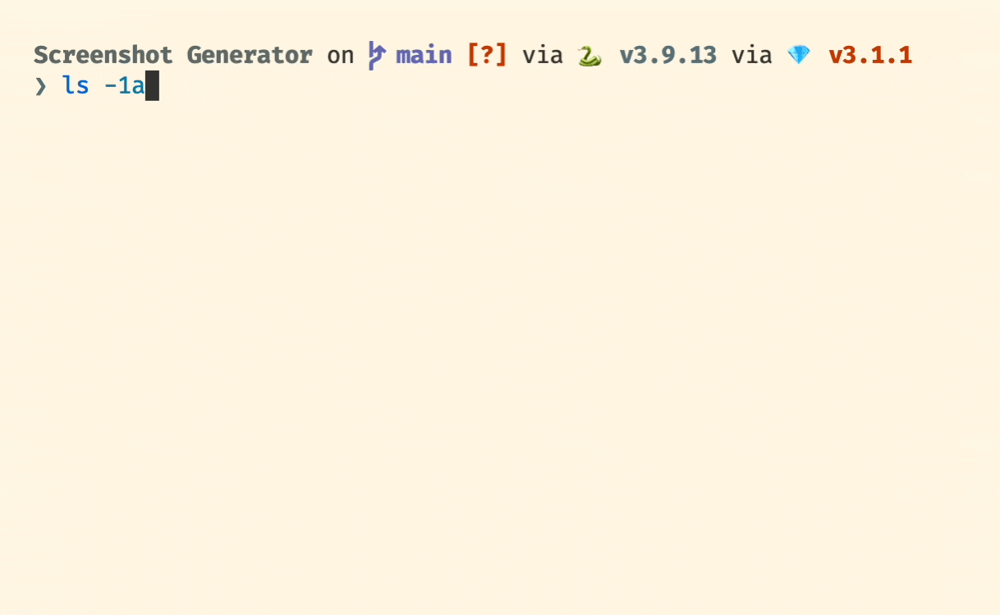

# App Store Screenshots Generator

This Python script uses the Python Image Library fork [Pillow](https://pillow.readthedocs.io/en/stable/) to convert raw screenshots from the iOS simulator or an iOS device into images that can be used on the App Store. It allows you to combine the image, its corresponding device bezels, a solid background color and some phrases into a single image.

## Requirements

- This script was built and tested with Python 3.9.13.
- The script requires the [Pillow](https://pillow.readthedocs.io/en/stable/installation.html) fork of the Python Image Library to be installed.
- This script only works on macOS as it has specific hardcoded paths it uses for the system and user font directories which it reads from.

## Installation

To install this script, simply download the latest source code and drag "generator.py" into an empty folder.

## Usage

To start, in the folder where you have generator.py, create a new folder called "Raw Shots" and place the screenshots you would like to convert inside. The script should automatically detect the screenshot's corresponding device. However, if exact specificity is required, find the "frameDimensionsLookupTable" declaration in the script to find the exact filename for a specific device (e.g. "iPhone13ProPortrait") and name your file that appending a dash ("-") and number. The filename should then look similar to "iPhone13ProPortrait-0".

Once you have finished organizing and adding your screenshots, run the script from the terminal. It will ask for a font, font size, and a list of phrases to use for the screenshots, which are all necessary.

The final composited images from the script should be in a new folder called "Composited Shots" with the same names they had in "Raw Shots".

## Customization

Additional CLI flags can be passed to the program to skip the provision of a font, font size, and phrases during the program's execution:

``--font *font name*``

``--font-size *font size (int)*``

``--phrases *phrases separated by a space (e.g. "Jump" "Run")*``

Please note, the phrases argument MUST always be the final argument as the number of phrases that can be provided is unlimited.

Extra flags to set the background and text color exist. They take colors in RGB format separated by a colon, for example "123:231:57":

``--background-color *color*``

``--text-color *color*``

A dry run flag exists for testing purposes and will perform all script processes except for the saving of a file:

``--dry-run``

## Expansion

To expand the number of devices available to composite with, please refer to the "frameDimensionsLookupTable" and "frameDataLookupTable". The same keys MUST be included in both dictionaries for proper functioning.

The dimensions lookup table dictionary in the script correlates a device type to screen size. To add a new device, you simply need to have the physical screen size for it (in pixels) to add.

The data lookup table dictionary pairs with the dimensions lookup table. The data lookup table specifies the JSON key path for the frame information for a particular device in MacStories' "Frame.json" file. The script downloads this file into a directory, "temp", on first launch. If you wish to add more devices, you must first locate the key path for a frame in the JSON.

